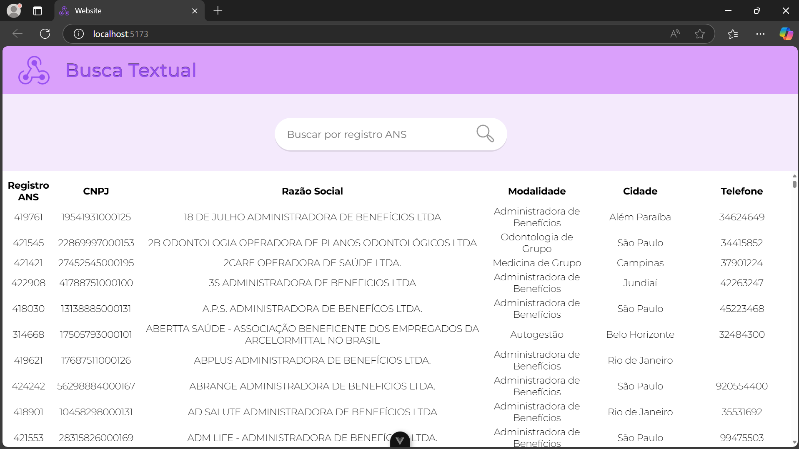

# Teste de Nivelamento
Repositório contendo as resoluções para o teste de nivelamento composto por 4 etapas.

## Web Scraping

**Requisitos:** _Beautiful Soup, Requests._

**Instalação:**
``` pip install requests beautifulsoup4 wget ```

O código _webscraping.py_ utiliza dos módulos Beautiful Soup, Requests e wget para obter dados da web. O Requests permite a realização de requisições HTTP a fim de obter o conteúdo de páginas web enquanto o Beautiful Soup permite a análise e a extração do tal conteúdo. Já o módulo wget permite o download com visualização dinâmica dos arquivos. Aproveitando das funcionalidades destes módulos, são resolvidos os itens 1.1 e 1.2. O módulo ZipFile, que já é nativo do Python, é utilizado para compactar os anexos extraídos, possibilitando a solução do item 1.3. 

## Transformação de Dados

**Requisitos:** _PyMuPdf, PdfPlumber._

**Instalação:**
``` pip install pymupdf pdfplumber ```

O código _tabelas.py_ utiliza dos módulos Fitz (PyMuPdf) e PdfPlumber para analisar arquivos PDF e possibilitar a extração de tabelas a partir destes. Estes módulos são utilizados para resolver o item 2.1. A partir do conteúdo extraído, uma função simples é utilizada para efetuar as substituições solicitadas no item 2.4. Os módulos csv e zipfile são utilizados para resolver os itens 2.2 e 2.3.

## Banco de Dados

**Requisitos:** _MySQL, configuração do diretório onde estarão alocados os arquivos .csv para construção do banco._

**Considerações:** Um código em Python (_preparacao.py_) foi elaborado para automatizar os itens da etapa de preparação. Este código utiliza dos mesmos módulos especificados na descrição da resolução do teste de Web Scraping, possibilitando um download simples e fácil.

O código _codigo.sql_ é um script MySQL para construir o banco de dados que receberá os dados extraídos durante a etapa de preparação. O banco de dados apresenta 8 tabelas para armazenar os dados dos trimestres de 2023 e de 2024, além de uma tabela para armazenar os dados do arquivo _Relatorio_cadop.csv_. O script também contém as queries requisitadas pelos itens 3.4 e 3.5, posicionadas ao final do arquivo. Além disso, para melhorar a performance de consultas, foram criados índices para alguns campos das tabelas.

## API

**Ferramentas:** _Django, Vue.js, MySQL._

**Requisitos:** _npm, node.js, django, vue, configuração do banco de dados no arquivo settings.py (Back)_

**Instalação:** Ao clonar este repositório, os arquivos necessários para a execução de ambas as aplicações cliente e servidora estarão disponibilizados na pasta API. Na pasta Front, estão os arquivos relacionados ao FrontEnd do projeto, construído com Vue.js. Já na pasta Back, estão os arquivos relacionados ao BackEnd do projeto, construído com Django. Para instalação dos arquivos necessários para execução da aplicação Cliente: no diretório do projeto (Front), execute ``` npm install ```. Depois, ``` npm run dev ```. O projeto estará rodando na porta 5173. Já para a instalação dos requisitos para a aplicação servidora: no diretório do projeto (Back), execute ```pip install django djangorestframework mysqlclient django-cors-headers```. Depois, ```python manage.py migrate```. Por fim,  ```python manage.py runserver 0.0.0.0:8001```. A aplicação estará rodando na porta 8001.

**Imagens do sistema em execução:**

Tela inicial com exibição da lista:




Exibição da funcionalidade de busca por Registro ANS:


Coleções no postman para confirmar o funcionamento das funcionalidades vide item 4.3:


